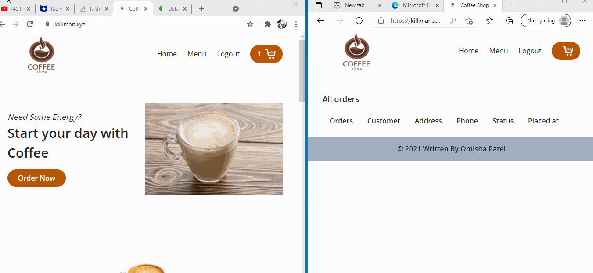

# Description:

This website can serve as a prototype for small businesses for real-time product ordering. Users can order products after login verification. Once an admin updates the order, users can see their order status in real-time.

## Website URL:

[CoffeeShop](https://killiman.xyz)

# Technologies Used:
* Node.js
* Express
* MongoDB with Moongose
* Passport.js
* Bcrypt.js
* Tailwind.CSS
* Socket.io
* NGINX
* AWS

# Working On

* Currently working on adding integration of payment to the website.

# Installation
* To run this project first clone it then install modules using `yarn install`
* Change the `env.example` file to `.env` and specify your secret for COOKIE SECRET and url for MONOGDB connection.
# Demo:

